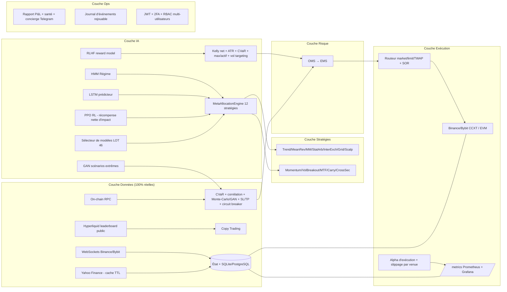

# QUANT-PORTAL — Plateforme de Trading Algorithmique Multi-Actifs

Bot de trading algorithmique institutionnel multi-actifs (Crypto, Forex, Or, Actions) avec :
données 100 % réelles, IA quantitative, exécution DEMO/REAL, monitoring Prometheus/Grafana,
télégram & dashboard temps réel.

> ⚠️ **Avertissement** : outil éducatif/expérimental. Aucune garantie de rentabilité. En mode
> `REAL`, des fonds réels sont engagés — testez longuement en DEMO et en paper-trading d'abord.

---

## ✨ Fonctionnalités

| Domaine | Modules |
|---|---|
| **Marchés** | BTC, ETH, SOL (Binance/Bybit), Or (GC=F), EUR/USD, AAPL, TSLA (Yahoo Finance) |
| **IA / Quant** | Détecteur de régime HMM, LSTM-like prédicteur, PPO-RL, méta-allocation à bandits, ensemble adaptatif (LOT 46), méta-labeling (triple barrière), GAN scénarios extrêmes (LOT 54), RLHF (LOT 55) |
| **Risque** | Kelly fractionnaire, sizing ATR, CVaR, corrélation multi-actifs, circuit breaker + kill switch, gates de sécurité REAL, macro-calendrier |
| **Exécution** | Binance/Bybit via CCXT, routeur multi-échange (SOR), slicing Almgren-Chriss, non-custodial EVM (Uniswap) |
| **Arbitrages** | Funding rate spot/perp, DEX↔CEX, volatilité/options |
| **Copytrading** | Module strict « zéro donnée fictive » (UNAVAILABLE tant qu'aucune source réelle n'est branchée) |
| **Ops** | Dashboard temps réel (WebSocket), Telegram Mini-App, journal des trades, conformité fiscale (FIFO), audit-logs chaînés cryptographiquement, Prometheus `/metrics` + Grafana |

## 🚀 Démarrage rapide (local)

```bash
git clone https://github.com/ambiancesignaturecontact-blip/trad.git
cd trad
pip install -r requirements.txt
# Optionnel — GAN & RLHF (LOT 54/55) :
pip install --index-url https://download.pytorch.org/whl/cpu torch
cp .env.example .env           # puis remplissez vos clés
uvicorn main:app --host 0.0.0.0 --port 8080 --workers 1
```

Ouvrez <http://localhost:8080> (dashboard) — API : `/api/status`, `/api/telemetry`, `/api/history`, `/metrics` (Prometheus).

Tests :

```bash
pytest tests/ -q      # 46 tests
```

## 🏗️ Architecture



## 🧪 Modes de fonctionnement

- **DEMO** (défaut) : capital virtuel 100 000 $, données 100 % réelles, aucun ordre réel envoyé.
- **REAL** : bascule via `/api/2fa-switch` (vérification 2FA requise). Exige :
  - clés API Binance/Bybit stockées (chiffrées) via `/api/keys`,
  - `SUPABASE_DB_URL` (PostgreSQL) — le fallback SQLite est **interdit** en mode REAL par conception,
  - les gates de sécurité (balises, drawdown, CVaR) doivent être vertes.

## 🧰 Variables d'environnement

| Variable | Requis | Description |
|---|---|---|
| `SUPABASE_DB_URL` | REAL | PostgreSQL production (ex: Supabase) |
| `SQLITE_DB_PATH` | dev | Chemin SQLite local (défaut `trading_platform.db`) |
| `SECRET_KEY_PATH` | non | Chemin de la clé Fernet (défaut `secret.key`) |
| `FERNET_KEY` | non | Clé Fernet (alternative à `secret.key` — recommandé en prod) |
| `TELEGRAM_BOT_TOKEN` | non | Token bot Telegram (notifications + Mini-App) |
| `TELEGRAM_CHAT_ID` | non | Chat ID pour les notifications push |
| `EVM_PRIVATE_KEY` | non | Clé privée du wallet non-custodial (arbitrages DEX) |
| `TRADING_MODE` | non | `DEMO` ou `REAL` (défaut `DEMO`) |
| `PORT` | Railway | Port HTTP (défaut 8080) |

## ☁️ Déploiement Railway

1. Push vers GitHub, import du dépôt sur Railway (le `railway.json` + `Dockerfile` sont fournis).
2. Variables : `SUPABASE_DB_URL`, `TELEGRAM_BOT_TOKEN`, `TELEGRAM_CHAT_ID`, `FERNET_KEY`, `EVM_PRIVATE_KEY`.
3. Le `Dockerfile` installe automatiquement PyTorch **CPU** (≈190 Mo) pour les moteurs GAN/RLHF.
4. Healthcheck : `/api/status` (200 = healthy). Monitoring : exposez `/metrics` sur Prometheus, dashboards Grafana dans `grafana/`.

## 🔐 Sécurité

- Clés API chiffrées au repos (Fernet), 2FA pour la bascule REAL.
- `secret.key` et `trading_platform.db` sont **exclus du dépôt** (`.gitignore`).
- Audit-logs chaînés (hash SHA-256).
- Gates de sécurité REAL : aucune donnée → aucun ordre (`HALT`).
- **Auth forcée automatiquement sur tout déploiement non-local** (Railway détecté
  via `PORT` / `RAILWAY_*`) : les routes d'action exigent alors un JWT même en DEMO —
  définissez `ADMIN_USER`, `ADMIN_PASSWORD` et `JWT_SECRET_KEY`. En local, si
  `AUTH_ENABLED` est vide, l'accès reste libre (mode démo).
- Les secrets (JWT auto-généré, mot de passe admin auto-généré) ne sont **jamais
  loggés en clair** : le mot de passe admin auto-généré est livré par Telegram DM
  (si `TELEGRAM_BOT_TOKEN` + `TELEGRAM_CHAT_ID`) ou via le fichier
  `.admin_credentials` (0600, exclu du dépôt) — à supprimer après première connexion.

## 🗺️ Feuille de route (non bloquant)

Voir `ROADMAP_INSTITUTIONNEL.md` pour l'analyse de gap détaillée (auth API, attribution par modèle,
sauvegardes DB, anti-doublons d'ordres, nettoyage de code mort…).

## 📄 Licence

Usage personnel/éducatif. Ni les auteurs ni la plateforme ne sont responsables des pertes
financières. **Le trading de cryptomonnaies comporte un risque élevé de perte en capital.**
